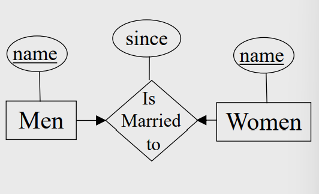
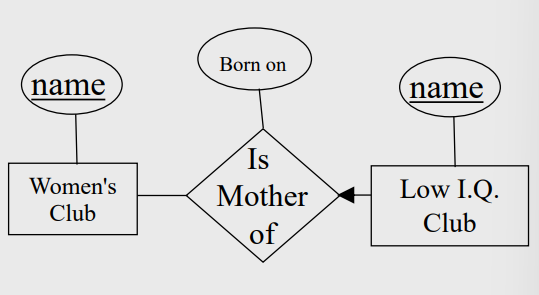
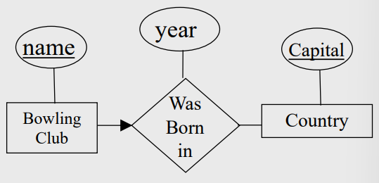
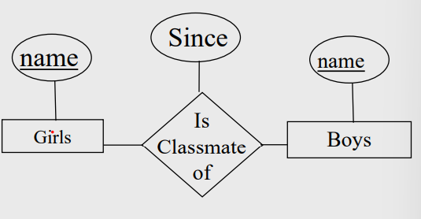

# E-R Model 2
# Table of Contents
- [Key Constraints](#key-constraints)
- [Practice](#practice)
---
## Key Constraints
Suppose the university has the following rule: A student is allowed to be advised by at most one professor. However, a professor is allowed to advise more than one student.

- There are four possible **key constraints**, they express the number of entities to which another entity can be associated via a relationship.

- For binary relationship sets between entity sets A and B, the mapping cardinality must be one of:
    - **One-to-one**:
        - An entity in A is associated with <u>at most one</u> entity in B, and An entity in B is associated with <u>at most one</u> entity in A.
            - *Example*: A man may be married to at most one woman, and a woman may be married to at most one man (Both men and women can be unmarried)
            
 
            
             

    - **One-to-many**:
        - An entity in A is associated with any number in B. An entity in B is associated with at most one entity in A.
            - *Example*: A woman may be the mother of many (or no) children. A person may have at most one mother.
            

            
            

    - **Many-to-one**:
        - An entity in A is associated with at most one entity in B. An entity in B is associated with any number in A. 
            - *Example*: Many people can be born in any county, but any individual is born in at most one country.
            

            
            

    - **Many-to-many**: 
        - Entities in A and B are associated with <u>any number</u> from each other
        

            
        

    Suppose the university has the following rule: A student is allowed to be advised by at most one professor. However, a professor is allowed to advise more than one student. 
    
    This is an example of a **many-to-one constraint**
    - many students can be advised by one professor
    - but each student can only have (at most) one advisor.

# Practice
### Researcher vs. Project**
- A person can be manager of many department.
- A department only need <u>at most one</u> manager.

Q- Person vs. Department

            

 

---
 

end of document
