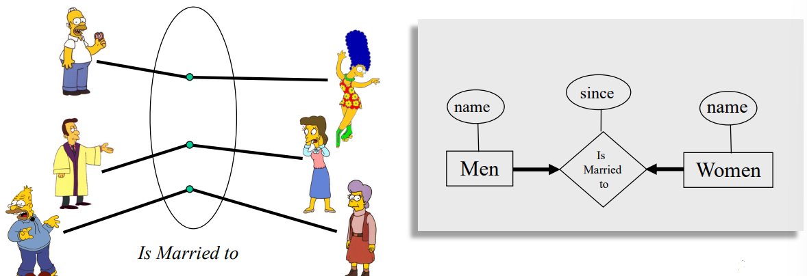
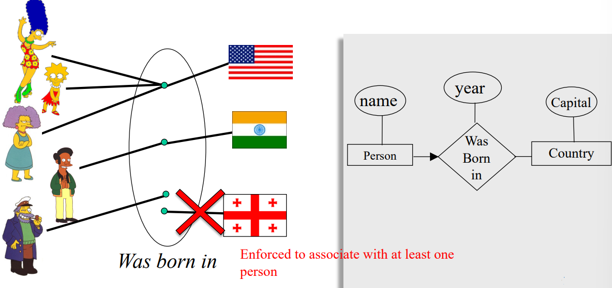
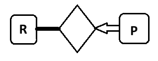
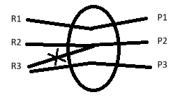

## E-R Model 3
# Table of Contents
- [Key Constraints 2](#key-constraints-2)
- [Practice](#practice-making-key-constraint)
---
## Key Constraints 2
### Participation Constraints Cont.
Earlier, we saw an example of a one-to-one key constraint, noting that a man may be married to at most one woman, and a woman may be married to at most one man (both men and women can be unmarried).

*Example*: Suppose we want to build a database for the “Springfield Married Persons Association”.
- In this case, everyone must be married!
- This condition cannot be described by Key Cosntraint
- Participation Constraint (at least one)

 

Participation constraints are indicated by bold lines in ER Diagrams.

*Example*: In Springfield Married Persons Association, in addition to Key Constraint, we need:
1. A man record always associate with at least one woman record.
2. A woman record always associate with at least one man record

 

*Example*: Many people can be born in any country , but any individual is born in at most one country. 
 In addition, a country should have at least one person.
1. Should a **person record**  always associate with at least on **country record**? No (Haven't Mentioned)
2. Should a **country record** always associate with ar least one **person record**? **Yes**

 

---
## Practice Making Key Constraint
<u>**Researcher vs. Project**</u>: *One-to-Many*
1. A reasearcher can participate in many projects
2. A Project can associate with no more than 1 reasearcher
3. A researcher must participate in at least one project
4. A project must associate with at least one researcher

 
 

---
 

end of document
